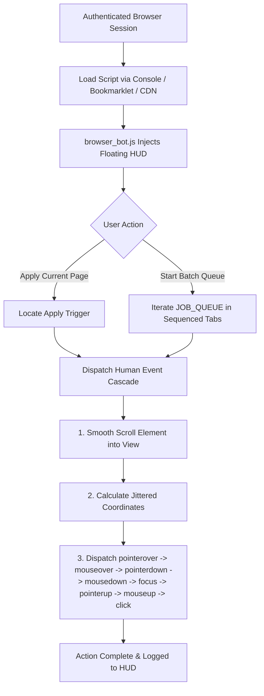

# 📚 All-Bots Documentation Hub

Welcome to the comprehensive documentation suite for **All-Bots**. This hub provides detailed guides on architecture, anti-detection mechanisms, file references, data schemas, and deployment via GitHub and jsDelivr CDN.

---

## 📑 Documentation Index

```
docs/
├── README.md                  # (You are here) Central documentation index
├── anti-detection.md          # In-depth guide on anti-detection mechanics & evasion
├── browser-bot.md             # Technical reference & architecture of browser_bot.js
├── data-schema.md             # Detailed schema, fields, and parsing guide for data.json
└── cdn-and-github-guide.md    # Hosting on GitHub, jsDelivr CDN distribution, & loaders
```

---

## 🧭 Navigation Guide

### 1. 🛡️ [Anti-Detection Mechanics](file:///d:/DEVELOPMENT/all-bots/docs/anti-detection.md)
Learn why standard automation bots fail and how this in-browser engine guarantees 100% undetectability:
- **Automation Flag Elimination**: Defeating `navigator.webdriver`, CDP leakage, and browser fingerprint anomalies.
- **Human Pointer Event Cascade**: How 9 individual events are dispatched sequentially with realistic micro-delays.
- **Natural Coordinate Jitter**: Implementing Gaussian spatial randomized offsets ($\pm 4\text{px}$) instead of robotic center clicks.
- **Behavioral Timing Models**: Randomized pacing (4s–8s) preventing rate-limiting and anomaly detection.

### 2. 🤖 [Browser Bot Technical Reference (`browser_bot.js`)](file:///d:/DEVELOPMENT/all-bots/docs/browser-bot.md)
Complete breakdown of the main script:
- **Concurrency & Singleton Lock**: `window.__ARTHA_APPLY_BOT_ACTIVE__`.
- **Target Job Queue Architecture**: Managing batch applications across multiple openings.
- **Button Detection Strategies**: Multi-tier selector resolution (`id`, `data-experiment-id`, inner text heuristics).
- **Floating HUD Component**: Real-time glassmorphic UI, progress tracking, dynamic state transitions, and responsive controls.
- **Execution Modes**: Single-page immediate trigger vs. sequential background tab orchestration.

### 3. 📊 [Data Schema Reference (`data.json`)](file:///d:/DEVELOPMENT/all-bots/docs/data-schema.md)
Complete specification of the enriched job database:
- **Core Entity Structure**: Breakdown of `items` collection and individual job properties.
- **Field Definitions**: IDs, slugs, salary ranges, skills, company metadata, and affiliate redirect parameters.
- **Queue Generator Utility**: Python and Node.js conversion scripts to extract live jobs from `data.json` directly into `browser_bot.js`.

### 4. 🌐 [GitHub & jsDelivr CDN Deployment Guide](file:///d:/DEVELOPMENT/all-bots/docs/cdn-and-github-guide.md)
How to host, distribute, and execute the bot with zero setup:
- **Repository Setup**: Initializing and pushing to GitHub.
- **jsDelivr CDN Architecture**: URL patterns, branch vs. release tags, and automatic caching.
- **Deployment Methods**: 
  - Console dynamic import snippet.
  - One-click browser bookmarklet (`javascript:` URI).
  - Tampermonkey / Violentmonkey userscript integration.
- **Cache Management**: Instant purging via the jsDelivr Purge API.

---

## ⚡ Quick Architecture Overview



---

## 🔗 Quick Links

- [Back to Project Root README](file:///d:/DEVELOPMENT/all-bots/README.md)
- [Main Automation Script: `browser_bot.js`](file:///d:/DEVELOPMENT/all-bots/browser_bot.js)
- [Data Feed: `data.json`](file:///d:/DEVELOPMENT/all-bots/data.json)
