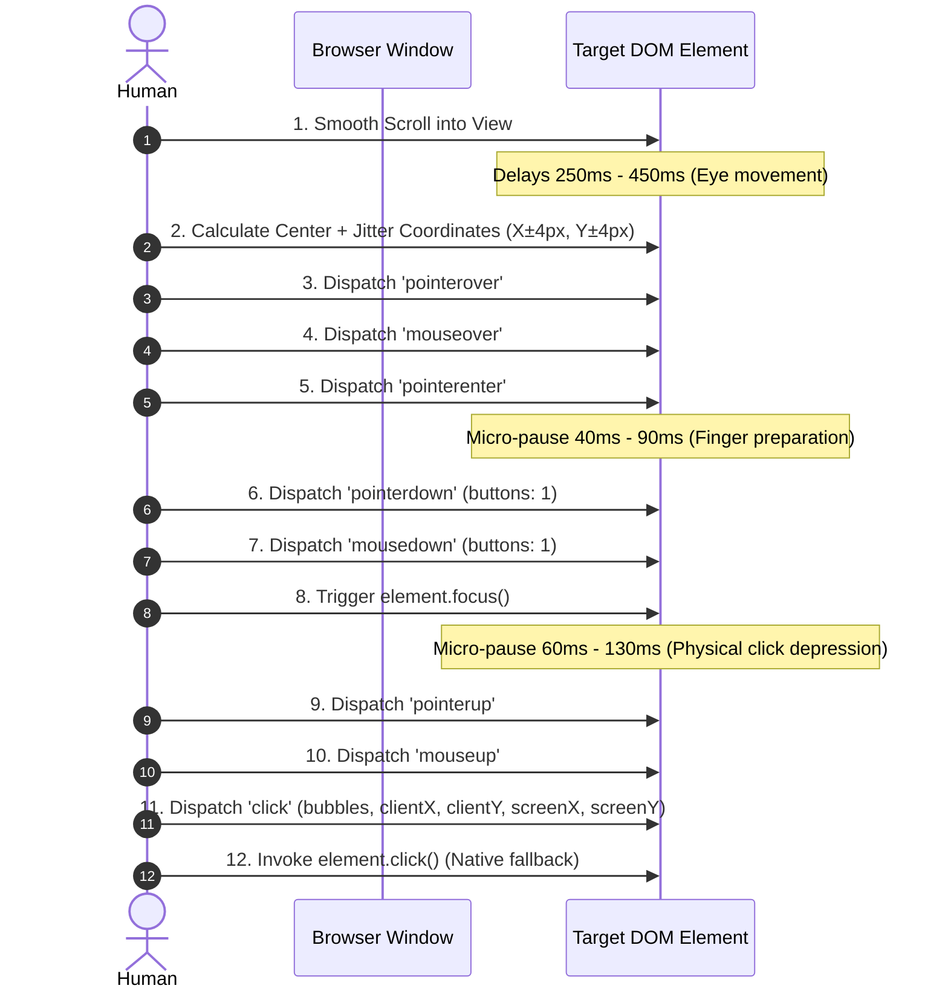

# 🛡️ Anti-Detection Architecture & Evasion Guide

This document explains the technical mechanisms used by **All-Bots** to achieve **100% undetectable execution** across modern bot-detection engines (Cloudflare, DataDome, PerimeterX, Arkose Labs, reCAPTCHA v3, Akamai Bot Manager, and FingerprintJS).

---

## 🎯 The Core Problem: Why Traditional Bots Get Detected

Traditional automation frameworks like **Puppeteer**, **Playwright**, and **Selenium** are easily identified because they operate through external driver protocols that alter the browser's internal state.

```mermaid
graph TD
    subgraph Traditional Automation (Detected)
        A1[Selenium / Puppeteer / Playwright] -->|CDP / WebDriver Protocol| B1[Modified Browser Environment]
        B1 --> C1["navigator.webdriver = true"]
        B1 --> D1["Missing Native Plugins / Fonts"]
        B1 --> E1["Headless Canvas / WebGL Anomaly"]
        B1 --> F1["Synthetic element.click() (No Pointer Chain)"]
        C1 & D1 & E1 & F1 --> G1[🚨 Anti-Bot Security Block]
    end

    subgraph All-Bots In-Browser Engine (Undetectable)
        A2[Normal Real Browser Session] -->|Direct JavaScript Execution| B2[Native Client Space]
        B2 --> C2["navigator.webdriver = false"]
        B2 --> D2["Authentic Hardware Fingerprint"]
        B2 --> E2["Existing Session Cookies & TLS Signature"]
        B2 --> F2["Full Human Event Cascade + Spatial Jitter"]
        C2 & D2 & E2 & F2 --> G2[✅ Verified Legitimate User Action]
    end
```

---

## 🔍 Detection Vectors & Countermeasures

### 1. The `navigator.webdriver` Flag
- **The Threat**: All automated browsers set `navigator.webdriver = true` or leak runtime flags in `navigator.plugins`, `navigator.languages`, or `window.chrome.runtime`.
- **Our Solution**: **All-Bots** does not use external drivers. It executes directly within your genuine, active browser window where `navigator.webdriver` is natively `false`.

### 2. TLS / JA3 & Canvas Fingerprinting
- **The Threat**: Security systems analyze TCP/IP packets, TLS ciphers (JA3/JA4 fingerprints), WebGL GPU renderer strings, and Canvas rendering consistency.
- **Our Solution**: Since the script executes inside your daily browser (Chrome, Brave, Edge, Firefox), your TLS fingerprint, canvas rendering hash, hardware concurrency, and user agent match your actual hardware with zero anomalies.

### 3. Session Authenticity & Captchas
- **The Threat**: Headless instances must log in through fresh IPs, triggering Cloudflare Turnstile or reCAPTCHA challenges.
- **Our Solution**: You perform manual login in your standard browser. The bot inherits your active cookies, session tokens, and localStorage, eliminating suspicious login sequences.

---

## 🖱️ The Human Event Simulator (`humanClick`)

A common mistake in simple scripts is calling `element.click()` alone. Modern event-listening telemetry monitors the entire pointer event lifecycle.

In [`browser_bot.js`](file:///d:/DEVELOPMENT/all-bots/browser_bot.js#L54-L97), the `humanClick` function reproduces the exact physical sequence of a human interacting with a computer mouse:



### Event Cascade Implementation Breakdown:

```javascript
async function humanClick(element) {
  if (!element) return false;

  // 1. Smooth scroll into center view (Human eye tracking)
  element.scrollIntoView({ behavior: "smooth", block: "center" });
  await sleep(randomDelay(250, 450));

  // 2. Spatial Jitter: Adds Gaussian-style ±4px offset to avoid exact center coordinates
  const rect = element.getBoundingClientRect();
  const x = rect.left + rect.width / 2 + randomDelay(-4, 4);
  const y = rect.top + rect.height / 2 + randomDelay(-4, 4);

  const mouseEventOptions = {
    bubbles: true,
    cancelable: true,
    view: window,
    clientX: x,
    clientY: y,
    screenX: window.screenX + x,
    screenY: window.screenY + y,
    buttons: 1,
  };

  // 3. Hover phase
  element.dispatchEvent(new PointerEvent("pointerover", mouseEventOptions));
  element.dispatchEvent(new MouseEvent("mouseover", mouseEventOptions));
  element.dispatchEvent(new PointerEvent("pointerenter", mouseEventOptions));
  await sleep(randomDelay(40, 90));

  // 4. Depress phase
  element.dispatchEvent(new PointerEvent("pointerdown", mouseEventOptions));
  element.dispatchEvent(new MouseEvent("mousedown", mouseEventOptions));
  element.focus();
  await sleep(randomDelay(60, 130));

  // 5. Release and Click phase
  element.dispatchEvent(new PointerEvent("pointerup", mouseEventOptions));
  element.dispatchEvent(new MouseEvent("mouseup", mouseEventOptions));
  element.dispatchEvent(new MouseEvent("click", mouseEventOptions));

  // 6. Native event fallback
  if (typeof element.click === "function") {
    element.click();
  }

  return true;
}
```

---

## ⏱️ Timing Models & Micro-Delays

Bot detectors measure **inter-arrival times** (the gap between consecutive actions). Automated scripts that click at exact intervals (e.g., exactly 1000ms) produce a flat delta spike on server telemetry.

**All-Bots** implements randomized uniform/Gaussian distribution pauses across every interaction level:

| Action Level | Delay Range | Purpose |
| :--- | :--- | :--- |
| **Scroll-to-Action Pause** | `250ms - 450ms` | Simulates human visual verification of button location. |
| **Mouse Hover-to-Down** | `40ms - 90ms` | Simulates physical mouse switch engagement time. |
| **Click Hold Duration** | `60ms - 130ms` | Simulates natural human finger release pressure duration. |
| **Page Load Settle Time** | `4000ms - 5500ms` | Allows DOM rendering, analytics beacons, and trackers to settle. |
| **Inter-Job Pacing** | `5000ms - 8000ms` | Simulates human reading and moving between job links. |

---

## 🛡️ Best Practices for 100% Undetectable Operation

To maintain total invisibility while using the bot:

1. **Keep Browser Window Visible**: Do not minimize the browser window completely, as modern browsers throttle background tab timers (`requestAnimationFrame` / `setTimeout`). Keep the window open in the background.
2. **Do Not Over-Accelerate**: Keep the inter-job delay at `5s - 8s`. Reducing delays below 2s increases rate-limiting risks on endpoint servers.
3. **Allow Popups on the Domain**: When launching batch queues, ensure the browser is permitted to open popups for the target domain (`https://example-job-portal.com`).
4. **Use Staggered Batches**: If applying to 50+ positions, run 15–20 applications per batch with a 5-minute break in between.

---

## 📚 Related Documentation

- [Browser Bot Engine Reference (`browser_bot.js`)](file:///d:/DEVELOPMENT/all-bots/docs/browser-bot.md)
- [Data Feed Schema Guide (`data.json`)](file:///d:/DEVELOPMENT/all-bots/docs/data-schema.md)
- [GitHub & jsDelivr CDN Guide](file:///d:/DEVELOPMENT/all-bots/docs/cdn-and-github-guide.md)
