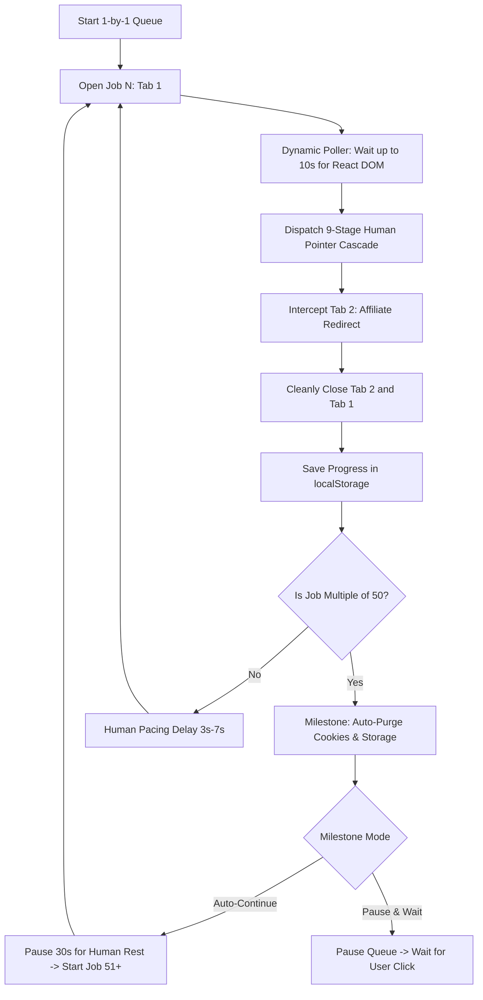

# ⚡ High-Performance 1-by-1 Sequential Auto-Applier (`auto_applier.js`)

This guide explains [`auto_applier.js`](file:///d:/DEVELOPMENT/all-bots/auto_applier.js), our flagship in-browser automation engine featuring a **Pure White Light-Theme HUD**, **vector SVG icons**, **1-Click Cookie/Storage Purge Button**, and **intelligent 50-Job Batch Milestone Handling**.

---

## 🏛️ Architecture & Workflow



---

## ✨ Key Capabilities

### 1. 🧹 1-Click Cookie, SessionStorage & LocalStorage Purge
A dedicated button is available right on the HUD:
- **`🧹 Wipe All Cookies, Session & Local Storage`**
- Instantly purges domain tracking cookies (`_ga`, `_gid`, `_intercom`, `sentry_*`, `mp_*`, `_utm*`), clears `localStorage`, and flushes `sessionStorage`.
- Automatically backs up and restores your bot queue progress so you don't lose your place!

### 2. 🛑 What Happens After Reaching 50 Jobs?
You have full control over what happens at every 50-job milestone (50, 100, 150, ..., 974):

| Milestone Setting | Behavior | Best Use Case |
| :--- | :--- | :--- |
| **`Auto-Continue`** *(Default)* | Purges all cookies/storage, takes a **30-second organic human break**, and automatically resumes with Job 51–100. | Hands-free background queue execution |
| **`Pause & Wait`** | Purges all cookies/storage, pauses execution, and waits for you to click **"Start Batch 2"**. | Controlled manual oversight per batch |

---

## 🎛️ HUD Controller Layout

```text
┌────────────────────────────────────────────────────────┐
│ 🛡️ ZERO-FOOTPRINT PRO                           _  ✕  │
│   Autonomous 1-by-1 Job Applier       🟢 (Active Dot)  │
├────────────────────────────────────────────────────────┤
│ [▓▓▓▓▓▓▓▓▓▓▓▓▓▓▓▓▓▓▓▓░░░░░░░░░░] 50%                   │
│ Progress: 50 / 974 (5%)    Applied: 48                 │
│ Active:   [51/974] Senior Data Engineer                │
│ Batch:    Batch 2 of 20 (Jobs 51–100)                  │
├────────────────────────────────────────────────────────┤
│ Pacing:         [Fast (3s)]  [[ Normal (5s) ]] [Stealth]│
│ At 50 Jobs:     [[ Auto-Continue ]]   [Pause & Wait]   │
├────────────────────────────┬─────────────┬─────────────┤
│ [▶ Start 1-by-1 Queue]     │ [⏭ Skip]   │ [↺ Reset]   │
├────────────────────────────┴─────────────┴─────────────┤
│ [🧹 Wipe All Cookies, Session & Local Storage]         │
├────────────────────────────────────────────────────────┤
│ 💡 How It Works:                                       │
│ 1. Opens 1 tab at a time (0% lag).                     │
│ 2. Dynamic poller finds & clicks Apply (up to 10s).    │
│ 3. Automatically closes both tabs cleanly.             │
│ 4. Auto-cleans cookies every 50 jobs & resumes!        │
└────────────────────────────────────────────────────────┘
```

---

## 🚀 Execution Methods

### Option 1: DevTools Console One-Liner (jsDelivr CDN)

Open Developer Tools (`F12` -> Console) on [https://artha.link](https://artha.link) and run:

```javascript
fetch(`https://cdn.jsdelivr.net/gh/Naman-mahi/zero-footprint@master/auto_applier.js?_t=${Date.now()}`)
  .then(r => r.text())
  .then(eval);
```

### Option 2: 1-Click Browser Bookmarklet

Create a browser bookmark named **`⚡ 1-by-1 Auto Applier`** with this URL:

```javascript
javascript:(function(){const s=document.createElement('script');s.src='https://cdn.jsdelivr.net/gh/Naman-mahi/zero-footprint@master/auto_applier.js?t='+Date.now();document.head.appendChild(s);})();
```

---

## 🌐 Global Developer Controls (`window.__AUTO_APPLIER__`)

Control the engine programmatically from the console:

```javascript
// Start or resume queue
window.__AUTO_APPLIER__.start();

// Pause queue
window.__AUTO_APPLIER__.pause();

// Skip current job
window.__AUTO_APPLIER__.skip();

// Reset progress back to 1
window.__AUTO_APPLIER__.reset();

// Wipe all cookies, localStorage, and sessionStorage
window.__AUTO_APPLIER__.wipeStorage();

// Inspect progress state
console.log(window.__AUTO_APPLIER__.getState());
```
