# ⚡ High-Performance 1-by-1 Sequential Auto-Applier (`auto_applier.js`)

This guide explains [`auto_applier.js`](file:///d:/DEVELOPMENT/all-bots/auto_applier.js), our high-performance in-browser automation engine featuring an **ultra-clean Light Frosted Glass UI**, **vector SVG icons**, **advanced anti-detection heuristics**, and a **Smart Session & Tracker Cleaner**.

---

## ✨ What Makes This Version Advanced

```mermaid
flowchart LR
    A[Embedded 974 Queue] --> B[1-by-1 Sequential Tab Orchestration]
    B --> C[Tab 1: Job Details Page]
    C --> D[Smooth Deceleration Scroll]
    D --> E[Gaussian Spatial Coordinate Jitter]
    E --> F[9-Stage Authentic Pointer Cascade]
    F --> G[Tab 2: Intercept Affiliate Redirect]
    G --> H[Dual-Tab Auto-Closer: Close Tab 1 & Tab 2]
    H --> I[Smart Tracker Cleaner]
    I --> J[Save Progress in localStorage]
    J --> K[Safe Human Pacing Delay 3s-7s]
    K --> B
```



### 1. 🎨 Ultra-Clean Light Frosted Glass HUD
- **Modern Light Design**: White/slate frosted glass (`backdrop-filter: blur(20px) saturate(180%)`) with clean borders and subtle depth shadows.
- **Vector SVG Icons**: Clean Lucide-style vector icons for Play, Pause, Skip, Reset, Clean, Shield, Minimize, and Close—zero emojis in the UI.
- **Real-Time Indicators**: Live animated gradient progress bar, active job title, success counter, and execution stream.

### 2. 🛡️ Advanced Anti-Detection Heuristics
- **Natural Deceleration Scrolling**: Smoothly centers the target button before mouse interaction.
- **Gaussian Spatial Jitter ($\pm 5\text{px}$)**: Eliminates robotic center clicks by introducing organic cursor offsets.
- **9-Stage Pointer Cascade**: Sequentially dispatches:
  `pointerover` $\rightarrow$ `mouseover` $\rightarrow$ `pointerenter` $\rightarrow$ `pointerdown` $\rightarrow$ `mousedown` $\rightarrow$ `focus()` $\rightarrow$ `pointerup` $\rightarrow$ `mouseup` $\rightarrow$ `click`.
- **Active Button Bitmasks**: Dispatches genuine `buttons: 1, which: 1` properties matching hardware mouse clicks.

### 3. 🧹 Smart Session, Cookie & Storage Management
One common concern with automated applications is whether cookies, sessions, and localStorage are corrupted:
- **Authentication Preserved**: Your active login session tokens (`auth_token`, `_artha_session`, `session`, `user_id`) remain 100% untouched so you never get logged out.
- **Tracker & Affiliate Bloat Cleared**: Built-in **Tracker Cleaner** (`window.__AUTO_APPLIER__.cleanTracking()`) purges third-party telemetry cookies (e.g. `_ga`, `_gid`, `_intercom`, `sentry_*`, `mp_*`, `amplitude_*`) to prevent cross-job tracking accumulation.
- **Isolated Storage**: Progress state is safely stored in a dedicated key (`__ZERO_FOOTPRINT_APPLIER_STATE__`), leaving all website data intact.

---

## 🚀 Execution Methods

### Option 1: DevTools Console One-Liner (jsDelivr CDN)

Open Developer Tools (`F12` -> Console) on [https://artha.link](https://artha.link) and run:

```javascript
fetch(`https://cdn.jsdelivr.net/gh/Naman-mahi/zero-footprint@master/auto_applier.js?_t=${Date.now()}`)
  .then(r => r.text())
  .then(eval);
```

### Option 2: 1-Click Browser Bookmarklet

Create a browser bookmark named **`⚡ 1-by-1 Auto Applier`** with this URL:

```javascript
javascript:(function(){const s=document.createElement('script');s.src='https://cdn.jsdelivr.net/gh/Naman-mahi/zero-footprint@master/auto_applier.js?t='+Date.now();document.head.appendChild(s);})();
```

---

## 🎛️ Control Panel Features

```text
┌────────────────────────────────────────────────────────┐
│ 🛡️ ZERO-FOOTPRINT  (1-by-1 Auto Applier)           _ ✕ │
├────────────────────────────────────────────────────────┤
│ [▓▓▓▓▓▓▓▓▓▓▓▓▓▓▓▓▓▓▓▓░░░░░░░░░░] 45%                   │
│ Progress: 438 / 974 (45%)   Applied: 432               │
│ Active:   [439/974] Senior Data Engineer               │
├────────────────────────────────────────────────────────┤
│ [Fast (3s)]  [[ Normal (5s) ]]  [Stealth (10s)]  [🧹 Clean]│
├────────────────────────────┬─────────────┬─────────────┤
│ [▶ Start 1-by-1 Queue]     │ [⏭ Skip]   │ [↺ Reset]   │
├────────────────────────────┴─────────────┴─────────────┤
│ Tab 1 opened. Waiting 3.5s for page hydration...       │
└────────────────────────────────────────────────────────┘
```

- **▶ Start / ⏸ Pause**: Toggle sequential application processing with zero lag.
- **⏭ Skip**: Skip the current position in the queue.
- **↺ Reset**: Reset application progress back to Job #1.
- **🧹 Clean**: Instantly purge analytics cookies and tracking telemetry.
- **Pacing Presets**: `Fast (3s)`, `Normal (5s)`, or `Stealth (10s)`.
- **_ Minimize**: Collapse HUD into a mini floating pill.

---

## 🌐 Global Developer Controls (`window.__AUTO_APPLIER__`)

Interact with the engine programmatically from the console:

```javascript
// Start / Resume application queue
window.__AUTO_APPLIER__.start();

// Pause queue
window.__AUTO_APPLIER__.pause();

// Skip active job
window.__AUTO_APPLIER__.skip();

// Reset progress back to 1
window.__AUTO_APPLIER__.reset();

// Purge tracking cookies without affecting login session
window.__AUTO_APPLIER__.cleanTracking();

// Inspect persistent state
console.log(window.__AUTO_APPLIER__.getState());
```

---

## 📚 Related Documentation

- [Anti-Detection Architecture Guide](file:///d:/DEVELOPMENT/all-bots/docs/anti-detection.md)
- [Main Repository README](file:///d:/DEVELOPMENT/all-bots/README.md)
- [GitHub & jsDelivr CDN Setup](file:///d:/DEVELOPMENT/all-bots/docs/cdn-and-github-guide.md)
- [Data Feed Schema Guide](file:///d:/DEVELOPMENT/all-bots/docs/data-schema.md)
