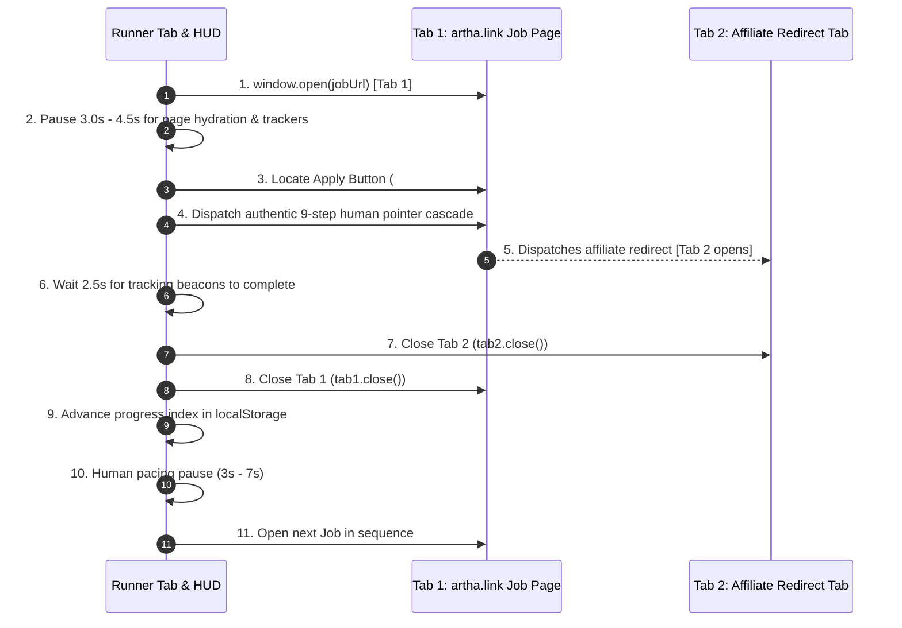

# ⚡ High-Performance 1-by-1 Sequential Auto-Applier (`auto_applier.js`)

This guide explains the dedicated [`auto_applier.js`](file:///d:/DEVELOPMENT/all-bots/auto_applier.js) script, built specifically for high-volume queues (500 to 1,000+ jobs) without overloading your computer or triggering bot detection.

---

## 🚀 Key Advantages

| Feature | Naive Multi-Tab Script | Zero-Footprint `auto_applier.js` |
| :--- | :--- | :--- |
| **Concurrency & Memory** | ❌ Opens 50+ tabs simultaneously, freezing RAM & CPU | ✅ Strictly **1-by-1 sequential processing** (never more than 1 tab active) |
| **Dual-Tab Handling** | ❌ Leaves redirect & employer tabs hanging open | ✅ **Auto-closes BOTH tabs**: Tab 1 (Job Details) & Tab 2 (Redirect/Affiliate link) |
| **Session Resume** | ❌ Lost progress if paused or browser closes | ✅ Persistent `localStorage` state (resumes right where you stopped) |
| **Human Pacing & Speed** | ❌ Robotic zero-delay bursts | ✅ 3 customizable pacing presets (`Fast 3s`, `Normal 5s`, `Stealth 10s`) |
| **Undetectability** | ❌ Basic `click()` detection | ✅ Full 9-step human pointer cascade + coordinate spatial jitter |

---

## 🔄 Execution Workflow



---

## 🕹️ Quick Start Guide

### Option 1: One-Liner Console Loader (jsDelivr CDN)

Navigate to [https://artha.link](https://artha.link), press `F12` -> Console, and run:

```javascript
fetch(`https://cdn.jsdelivr.net/gh/Naman-mahi/zero-footprint@master/auto_applier.js?_t=${Date.now()}`)
  .then(r => r.text())
  .then(eval);
```

### Option 2: 1-Click Browser Bookmarklet

Create a browser bookmark named `⚡ 1-by-1 Auto Applier` and set the URL to:

```javascript
javascript:(function(){const s=document.createElement('script');s.src='https://cdn.jsdelivr.net/gh/Naman-mahi/zero-footprint@master/auto_applier.js?t='+Date.now();document.head.appendChild(s);})();
```

---

## 🎛️ Dashboard & Control Panel Features

The floating HUD provides complete real-time control:

```text
┌────────────────────────────────────────────────────────┐
│ 🟢 AUTO-APPLIER (1-BY-1 ENGINE)                    _ ✕ │
├────────────────────────────────────────────────────────┤
│ [▓▓▓▓▓▓▓▓▓▓▓▓▓▓▓▓▓▓▓▓░░░░░░░░░░] 45%                   │
│ Queue: 438 / 974 (45%)    Applied: 432                 │
│ Target: [439/974] Senior Backend Engineer              │
├────────────────────────────────────────────────────────┤
│ Pacing:  [Fast (3s)]  [[ Normal (5s) ]]  [Stealth (10s)]│
├────────────────────────────┬─────────────┬─────────────┤
│ [⏸️ Pause Queue]           │ [⏩ Skip]   │ [↺ Reset]   │
├────────────────────────────┴─────────────┴─────────────┤
│ Tab 1 opened. Waiting 3.5s for page hydration...       │
└────────────────────────────────────────────────────────┘
```

- **🚀 Start / ⏸️ Pause**: Toggle sequential processing at any moment.
- **⏩ Skip**: Skip the current job opening without applying.
- **↺ Reset**: Reset persistent progress back to Job #1.
- **Speed Presets**:
  - `Fast (3s)`: Quick application turnaround.
  - `Normal (5s)`: Balanced human pacing (Recommended).
  - `Stealth (10s)`: Conservative, ultra-realistic human timing.
- **_ Minimize**: Collapse the HUD into a sleek mini bar so it doesn't obstruct your view.

---

## 🌐 Global Developer Controls (`window.__AUTO_APPLIER__`)

Control the runner programmatically from DevTools:

```javascript
// Start or resume queue
window.__AUTO_APPLIER__.start();

// Pause queue
window.__AUTO_APPLIER__.pause();

// Skip current job
window.__AUTO_APPLIER__.skip();

// Reset progress back to 1
window.__AUTO_APPLIER__.reset();

// Load custom array of URLs
window.__AUTO_APPLIER__.setQueue([
  "https://artha.link/@eanxt/jobs/director-of-infrastructure-engineering-micro1-3edbafcb",
  // ...
]);

// Inspect current progress
console.log(window.__AUTO_APPLIER__.getState());
```

---

## 📁 Source JSON Files

The 974 combined URLs originate from the JSON feed outputs generated by `fetch-jobs.js`:
- [`out_20260902_133307.json`](file:///d:/DEVELOPMENT/all-bots/out_20260902_133307.json): 500 job openings.
- [`out_20260902_133816.json`](file:///d:/DEVELOPMENT/all-bots/out_20260902_133816.json): 500 job openings.
- [`jobs_queue.json`](file:///d:/DEVELOPMENT/all-bots/jobs_queue.json): 974 unique deduplicated URLs.
