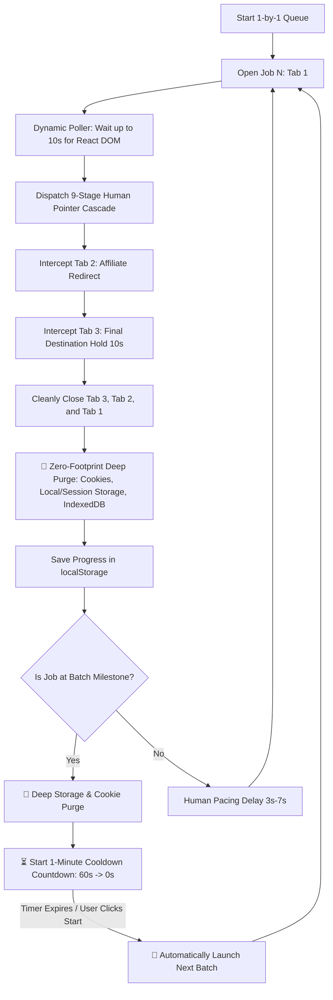

# ⚡ In-Browser Auto-Appliers: `cpc_applier.js` & `auto_applier.js`

This guide details our flagship in-browser automation engines:
1. **`cpc_applier.js`**: Dedicated engine for the **10,000 High-CPC queue** (`cpc_value: 0.048` & `sort_by: "high_cpc"`).
2. **`auto_applier.js`**: Engine for the **8,987 Recommendation queue**.

Both scripts feature a **pure white light-theme floating HUD**, **dynamic user-selectable batch sizes (25 / 50 / 100)**, **automatic 1-minute batch autostart (zero manual click required)**, **per-job zero-footprint cookie & storage purge**, **10-second mandatory destination hydration**, and **3-tab auto-closing**.

---

## 🏛️ Architecture & Workflow



---

## ✨ Key Capabilities

### 1. ⏳ Automatic 1-Minute Batch Autostart (No Manual Click Required)
When any batch (e.g. 25, 50, or 100 jobs) completes:
- The bot **purges all cookies and storage**.
- Initiates an **organic 60-second (1 minute) cooldown timer** with a real-time countdown displayed on the HUD button and log bar (`"Start Batch 2 now (48s autostart)"`).
- Upon reaching `0s`, it **automatically begins the next batch immediately** without requiring any manual interaction.
- If you wish to skip the cooldown and proceed immediately, simply click the main action button at any time.

### 2. 🎯 User-Selectable Batch Sizes (25 / 50 / 100)
Directly on the floating HUD, you can select your preferred batch size:
- **`[25]`**: Ideal for quick validation sessions and light testing.
- **`[50]`**: Standard recommended batch size with optimal rest intervals.
- **`[100]`**: High-volume unattended execution.

The engine recalibrates batch progress (e.g. `Batch 3 of 200`) and milestone checks in real time upon selection.

### 3. 🧼 Per-Job Deep Zero-Footprint Storage & Cookie Purge
Unlike basic bots that only clear storage at batch boundaries, Zero-Footprint executes a **full storage & cookie purge on EVERY SINGLE job application**:
- **Domain & Subdomain Cookies**: Scans `document.cookie` and deletes every cookie across root domain and all parent/subdomain scopes (`domain=.artha.link`, `domain=my.artha.link`, `path=/`).
- **Web Storage**: Executes `localStorage.clear()` (safely retaining the bot's own isolated progress key) and `sessionStorage.clear()`.
- **IndexedDB**: Iterates `window.indexedDB.databases()` and drops tracking/session databases.

### 4. ⏳ 10-Second Mandatory Destination Hydration
When the apply button is clicked and redirects to the employer portal or affiliate landing page:
- Tab 3 is monitored and held open for **10 full seconds**.
- Guarantees that affiliate tracking pixels, UTM analytics beacons, and conversion scripts complete their network requests.
- Closes Tab 3, Tab 2, and Tab 1 sequentially without leaving orphan browser tabs.

---

## 🎛️ HUD Controller Layout

```text
┌────────────────────────────────────────────────────────┐
│ 💎 ZERO-FOOTPRINT PRO (10K CPC)                 _  ✕  │
│   Autonomous 1-by-1 Job Applier       🟢 (Active Dot)  │
├────────────────────────────────────────────────────────┤
│ [▓▓▓▓▓▓▓▓▓▓▓▓▓▓▓▓▓▓▓▓░░░░░░░░░░] 25%                   │
│ Progress: 25 / 10000 (0.25%)    Applied: 25            │
│ Active:   [26/10000] Senior Data Engineer              │
│ Batch:    Batch 2 of 200 (Jobs 51–100)                 │
├────────────────────────────────────────────────────────┤
│ Batch Size:     [ 25 ]  [[ 50 ]]  [ 100 ]              │
│ Pacing:         [Fast (3s)]  [[ Normal (5s) ]] [Stealth]│
├────────────────────────────┬─────────────┬─────────────┤
│ [⏳ Start Batch 2 now (45s)]│ [⏭ Skip]   │ [↺ Reset]   │
├────────────────────────────┴─────────────┴─────────────┤
│ [🧹 Wipe All Cookies, Session & Local Storage]         │
├────────────────────────────────────────────────────────┤
│ 💡 Operational Guarantees:                             │
│ • Runs strictly 1-by-1 (0% machine RAM/CPU lag).       │
│ • Clears cookies & session storage after EACH job.     │
│ • 1-minute autostart cooldown between batches.         │
│ • Holds destination pages for 10s tracking hydration.  │
│ • Auto-closes all 3 tabs cleanly.                      │
└────────────────────────────────────────────────────────┘
```

---

## 🚀 Execution Methods

### 💎 10,000 High-CPC Applier (`cpc_applier.js`)

#### DevTools Console One-Liner:
```javascript
fetch(`https://cdn.jsdelivr.net/gh/Naman-mahi/zero-footprint@master/cpc_applier.js?_t=${Date.now()}`)
  .then(r => r.text())
  .then(eval);
```

#### 1-Click Bookmarklet:
```javascript
javascript:(function(){const s=document.createElement('script');s.src='https://cdn.jsdelivr.net/gh/Naman-mahi/zero-footprint@master/cpc_applier.js?t='+Date.now();document.head.appendChild(s);})();
```

---

### ⚡ Standard Recommendation Applier (`auto_applier.js`)

#### DevTools Console One-Liner:
```javascript
fetch(`https://cdn.jsdelivr.net/gh/Naman-mahi/zero-footprint@master/auto_applier.js?_t=${Date.now()}`)
  .then(r => r.text())
  .then(eval);
```

#### 1-Click Bookmarklet:
```javascript
javascript:(function(){const s=document.createElement('script');s.src='https://cdn.jsdelivr.net/gh/Naman-mahi/zero-footprint@master/auto_applier.js?t='+Date.now();document.head.appendChild(s);})();
```

---

## 🌐 Programmatic Developer API

Control the engine directly from the browser console:

```javascript
// Start or resume execution (or skip cooldown)
window.__CPC_APPLIER__.start();
window.__AUTO_APPLIER__.start();

// Skip 1-minute cooldown immediately
window.__CPC_APPLIER__.skipCooldown();

// Pause queue
window.__CPC_APPLIER__.pause();

// Skip current job
window.__CPC_APPLIER__.skip();

// Reset queue progress back to 1
window.__CPC_APPLIER__.reset();

// Manually trigger deep cookie/storage purge
window.__CPC_APPLIER__.wipeStorage();

// Inspect live progress state
console.log(window.__CPC_APPLIER__.getState());
```
