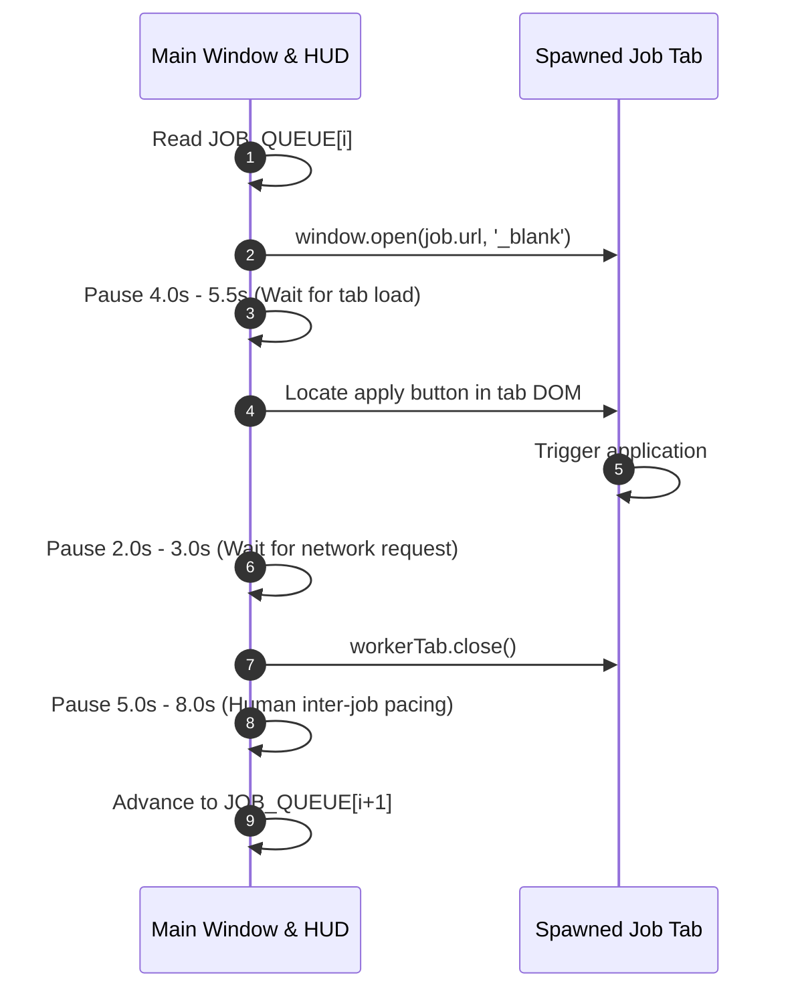

# 🤖 Browser Bot Technical Reference (`browser_bot.js`)

This document provides a comprehensive technical overview and module-by-module breakdown of [`browser_bot.js`](file:///d:/DEVELOPMENT/all-bots/browser_bot.js), the standalone client-side automation engine.

---

## 🏛️ Module Architecture

```text
browser_bot.js (Self-Executing IIFE)
├── 🔒 Singleton Instance Guard (window.__ARTHA_APPLY_BOT_ACTIVE__)
├── 📋 Job Queue Definition (JOB_QUEUE array)
├── 🛡️ Human Event Simulator (sleep, randomDelay, humanClick)
├── 🔍 DOM Button Discovery Engine (findApplyButton)
├── 🖥️ Floating Control Panel (HUD DOM & CSS Glassmorphism)
├── ⚡ Single-Page Apply Controller (applyOnCurrentPage)
├── 🚀 Batch Queue Orchestrator (startBatchQueue)
└── 🎛️ Event Listeners & Auto-Trigger Hook
```

---

## 📋 Module 1: Singleton Instance Guard

Lines: [`browser_bot.js:L19-L25`](file:///d:/DEVELOPMENT/all-bots/browser_bot.js#L19-L25)

```javascript
if (window.__ARTHA_APPLY_BOT_ACTIVE__) {
  console.warn("⚠️ Bot is already running. Refresh the page to reset.");
  return;
}
window.__ARTHA_APPLY_BOT_ACTIVE__ = true;
```

- **Purpose**: Prevents duplicate HUDs, double event bindings, or concurrent loop conflicts if a user pastes the script multiple times into the console or triggers it via bookmarklet.
- **Teardown**: Setting `window.__ARTHA_APPLY_BOT_ACTIVE__ = false` is handled automatically when the user closes the HUD via the `✕` button.

---

## 📋 Module 2: Target Job Queue (`JOB_QUEUE`)

Lines: [`browser_bot.js:L29-L46`](file:///d:/DEVELOPMENT/all-bots/browser_bot.js#L29-L46)

An array of job targets containing title descriptors and direct web application URLs:

```javascript
const JOB_QUEUE = [
  { 
    title: "Data Engineer @ micro1", 
    url: "https://artha.link/@ritu_singh_647119359/jobs/data-engineer-micro1-467d5920" 
  },
  { 
    title: "Senior Database Reliability Engineer @ micro1", 
    url: "https://artha.link/@ritu_singh_647119359/jobs/senior-database-reliability-engineer-micro1-8ef9e2c8" 
  },
  // ... Additional job openings
];
```

### Extending the Queue:
You can append new entries by extracting jobs from [`data.json`](file:///d:/DEVELOPMENT/all-bots/data.json) (see [Data Schema Guide](file:///d:/DEVELOPMENT/all-bots/docs/data-schema.md)).

---

## 📋 Module 3: Multi-Selector Button Resolver (`findApplyButton`)

Lines: [`browser_bot.js:L102-L114`](file:///d:/DEVELOPMENT/all-bots/browser_bot.js#L102-L114)

Target web platforms often employ A/B testing, dynamic class names, or variant DOM templates. The resolver uses a 3-tier cascade fallback mechanism:

```javascript
function findApplyButton(doc = document) {
  // Tier 1: Canonical static ID selector
  const byId = doc.getElementById("creator-job-details-apply-job-trigger");
  if (byId) return byId;

  // Tier 2: Experiment/Feature Flag data attribute
  const byExp = doc.querySelector('[data-experiment-id="creator-apply-job-trigger"]');
  if (byExp) return byExp;

  // Tier 3: Heuristic semantic text search across clickable elements
  const buttons = Array.from(doc.querySelectorAll("button, a, div[role='button']"));
  return buttons.find((b) => {
    const txt = (b.innerText || b.textContent || "").trim().toLowerCase();
    return txt === "apply now" || txt.includes("apply now") || txt.startsWith("apply");
  }) || null;
}
```

- **Scope Support**: Accepts an optional `doc` parameter (`document` or `popup.document`) allowing the same resolver to inspect popup windows and child tabs.

---

## 📋 Module 4: Floating Glassmorphic Control Panel (HUD)

Lines: [`browser_bot.js:L119-L203`](file:///d:/DEVELOPMENT/all-bots/browser_bot.js#L119-L203)

The HUD provides a non-intrusive, styled floating interface placed in the bottom-right corner (`z-index: 9999999`):

```text
┌────────────────────────────────────────────────────────┐
│ 🟢 UNDETECTABLE APPLY BOT                            ✕ │
├────────────────────────────────────────────────────────┤
│ Status:   Ready (16 queued)                            │
│ Progress: 0 / 16                                       │
├────────────────────────────┬───────────────────────────┤
│ [⚡ Apply Current Page]    │ [🚀 Start Batch (16)]     │
├────────────────────────────┴───────────────────────────┤
│ Bot loaded. Click 'Start Batch' to begin.              │
└────────────────────────────────────────────────────────┘
```

### Key UI Features:
- **Dark Theme with Glassmorphism**: `background: rgba(15, 23, 42, 0.96)`, `backdrop-filter: blur(12px)`.
- **Pulse Status Indicator**: Dynamic glowing emerald status pill.
- **Real-Time Log Stream**: Scrolling log area displaying live execution steps.
- **Stateful Buttons**: Dynamic text swapping (`🚀 Start Batch` ↔ `⏹️ Stop Batch`).

---

## 📋 Module 5: Execution Modes

### 1. Single Page Mode (`applyOnCurrentPage`)
Lines: [`browser_bot.js:L207-L226`](file:///d:/DEVELOPMENT/all-bots/browser_bot.js#L207-L226)

- Scans the active page for the apply trigger button.
- If found, dispatches `humanClick(btn)`.
- Updates the HUD with green confirmation status.
- If triggered automatically on a direct job page, it waits `1500ms` for DOM hydration before firing.

### 2. Batch Queue Orchestrator (`startBatchQueue`)
Lines: [`browser_bot.js:L233-L285`](file:///d:/DEVELOPMENT/all-bots/browser_bot.js#L233-L285)



- **Graceful Cancellation**: User can click `⏹️ Stop Batch` at any time; the loop checks `if (!isRunningBatch) break;` at each step.
- **Popup Handling**: Detects if `window.open` returns `null` and alerts the user to grant popup permissions in the address bar.

---

## 🎛️ How to Run & Test Locally

1. Open Chrome / Brave / Edge.
2. Navigate to `https://artha.link`.
3. Open Developer Tools (`F12`) -> **Console**.
4. Paste the script and hit `Enter`.
5. Observe the HUD appearance and console log output.
