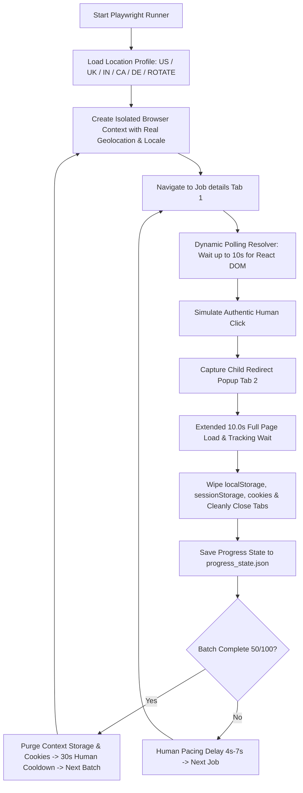

# 🚀 Production Playwright Multi-Location Runner (`playwright_applier.js`)

This technical reference explains how to use **`global-applier/playwright_applier.js`**, our production-grade Node.js Playwright automation runner designed for high-scale, multi-location batch processing with **5 Regional Location Profiles**, **extended redirect timers**, **state persistence**, and **automated storage cleansing**.

---

## 🏛️ Architecture & Execution Flow



---

## 🌍 5 Regional Location Profiles

Playwright provides built-in emulation of genuine regional coordinates, timezone IDs, and language headers:

| Code | Location Profile | Geolocation (Lat / Lng) | Timezone ID | Locale |
| :--- | :--- | :--- | :--- | :--- |
| **`US`** | **United States (New York)** | `40.7128`, `-74.0060` | `America/New_York` | `en-US` |
| **`UK` / `GB`** | **United Kingdom (London)** | `51.5074`, `-0.1278` | `Europe/London` | `en-GB` |
| **`IN`** | **India (Hyderabad / Bengaluru)** | `17.3850`, `78.4867` | `Asia/Kolkata` | `en-IN` |
| **`CA`** | **Canada (Toronto)** | `43.6532`, `-79.3832` | `America/Toronto` | `en-CA` |
| **`DE`** | **Germany / Europe (Frankfurt)** | `50.1109`, `8.6821` | `Europe/Berlin` | `de-DE` |
| **`ROTATE`** | **Auto-Rotation** | Rotates across US $\rightarrow$ UK $\rightarrow$ IN $\rightarrow$ CA $\rightarrow$ DE for each job |

---

## 💻 CLI Commands & Examples

### 1. Run 50 Jobs with Visible Browser Window (United States Profile)
```bash
node global-applier/playwright_applier.js --location US --batch 50 --headed
```

### 2. Run 50 Jobs for United Kingdom with 6-Second Close Timer
```bash
node global-applier/playwright_applier.js --location UK --batch 50 --close-wait 6000 --headed
```

### 3. Run 100 Jobs in Silent Headless Mode with Location Auto-Rotation
```bash
node global-applier/playwright_applier.js --location ROTATE --batch 100 --start 0
```

### 4. Resume from Last Saved Progress
If you stopped the script using `Ctrl+C`, it automatically saves `progress_state.json`. You can resume instantly:
```bash
node global-applier/playwright_applier.js --resume --headed
```

---

## ⚙️ CLI Parameter Reference

| Parameter | Type | Default | Description |
| :--- | :--- | :--- | :--- |
| `--batch` | `number` | `50` | Number of applications per batch (`50` or `100`). |
| `--location` | `string` | `US` | Regional profile (`US`, `UK`, `IN`, `CA`, `DE`, or `ROTATE`). |
| `--close-wait` | `number` | `5000` | Milliseconds to wait before closing the redirect tab (gives ample time for tracking beacons). |
| `--start` | `number` | `0` | Zero-indexed starting position in the queue. |
| `--resume` | `flag` | `false` | Resumes directly from the last saved state in `progress_state.json`. |
| `--headed` | `flag` | `false` | Launches a visible Chromium window instead of headless mode. |
| `--speed` | `string` | `normal` | Pacing delay preset (`fast`: 3-4.5s, `normal`: 5-7s, `stealth`: 8-12s). |

---

## 📊 Summary Reports & State Persistence

- **State File (`progress_state.json`)**: Automatically maintained in real-time. Captures current index, applied count, and timestamp.
- **Execution Report (`results_<timestamp>.json`)**: Generated upon run completion. Records full breakdown of all applied URLs, location profiles used, and success metrics.
