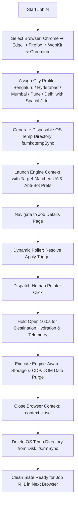

# 🚀 Production Playwright Multi-City & Multi-Browser Runner (`playwright_applier.js`)

This technical reference documents **`global-applier/playwright_applier.js`**, our production-grade Node.js Playwright automation runner featuring **dynamic multi-browser rotation across 5 distinct browser targets**, **100% OS-level disposable temporary profiles**, **multi-city domestic geo-rotation with spatial GPS jitter**, **10-second destination page load timers**, and **batch navigation**.

---

## 🌐 Dynamic Multi-Browser Engine Matrix

The engine dynamically rotates across 5 distinct browser profiles and rendering engines for unmatched anti-fingerprinting diversity:

| Browser Target | Engine | Channel / Mode | Anti-Detection & Profile Capabilities |
| :--- | :--- | :--- | :--- |
| **🟢 Google Chrome** | `chromium` | Native `chrome` channel | Native OS Chrome binary, Chrome 124 UA, CDP storage purge. |
| **🔷 Microsoft Edge** | `chromium` | Native `msedge` channel | Native OS Edge binary, Edge 124 UA, CDP storage purge. |
| **🦊 Mozilla Firefox** | `firefox` | Gecko Engine | Firefox 125 UA, `dom.webdriver: false`, disabled automation extensions. |
| **🧭 Apple WebKit** | `webkit` | Safari Engine | Safari / WebKit 17.4 macOS UA, WebKit DOM storage flush. |
| **🌐 Bundled Chromium** | `chromium` | Standard Chromium | Clean Chromium sandbox, Blink anti-automation flags. |



---

## 🎯 Batch & Browser Execution Commands

### 1. Run with Multi-Browser Engine Rotation (Default)
Cycles each job through **Chrome ➔ Edge ➔ Firefox ➔ WebKit ➔ Chromium**:
```powershell
node playwright_applier.js --location IN --batch 50 --browser rotate --headed
```

### 2. Run with Random Browser Selection Per Job
Randomly picks from the browser matrix for each application:
```powershell
node playwright_applier.js --location IN --batch 50 --browser random --headed
```

### 3. Pin to a Specific Browser Engine
Run exclusively in Mozilla Firefox, Apple WebKit, or Microsoft Edge:
```powershell
# Firefox
node playwright_applier.js --location IN --batch 50 --browser firefox --headed

# Apple WebKit (Safari Engine)
node playwright_applier.js --location IN --batch 50 --browser webkit --headed

# Microsoft Edge
node playwright_applier.js --location IN --batch 50 --browser msedge --headed

# Google Chrome
node playwright_applier.js --location IN --batch 50 --browser chrome --headed
```

### 4. Custom Browser Subset Rotation
Rotate only through chosen browsers (e.g., Chrome, Edge, and Firefox):
```powershell
node playwright_applier.js --location IN --batch 50 --browser-list chrome,msedge,firefox --headed
```

### 5. Run Specific Batches
```powershell
# Batch 1 (Jobs 1 to 50)
node playwright_applier.js --location IN --batch 50 --batch-num 1 --headed

# Batch 2 (Jobs 51 to 100)
node playwright_applier.js --location IN --batch 50 --batch-num 2 --headed

# Batch 3 (Jobs 101 to 150)
node playwright_applier.js --location IN --batch 50 --batch-num 3 --headed
```

### 6. Run All Batches Automatically (With 30s Cooldown)
```powershell
node playwright_applier.js --location IN --batch 50 --auto-next --headed
```

### 7. Resume from Exact Stopped Position
If you ever press `Ctrl+C`, run `--resume` to continue immediately:
```powershell
node playwright_applier.js --resume --headed
```

---

## 🏙️ Multi-City Domestic Geolocation Database

Each job automatically rotates across major tech hubs with **$\pm 500\text{m}$ spatial Gaussian GPS jitter** so no two applications share the exact same coordinates:

### 🇮🇳 India (`--location IN`):
| City | Base Latitude | Base Longitude | Timezone | Locale |
| :--- | :--- | :--- | :--- | :--- |
| **Bengaluru** | `12.9716` | `77.5946` | `Asia/Kolkata` | `en-IN` |
| **Hyderabad** | `17.3850` | `78.4867` | `Asia/Kolkata` | `en-IN` |
| **Mumbai** | `19.0760` | `72.8777` | `Asia/Kolkata` | `en-IN` |
| **Pune** | `18.5204` | `73.8567` | `Asia/Kolkata` | `en-IN` |
| **Chennai** | `13.0827` | `80.2707` | `Asia/Kolkata` | `en-IN` |
| **Delhi NCR** | `28.6139` | `77.2090` | `Asia/Kolkata` | `en-IN` |
| **Kolkata** | `22.5726` | `88.3639` | `Asia/Kolkata` | `en-IN` |
| **Ahmedabad** | `23.0225` | `72.5714` | `Asia/Kolkata` | `en-IN` |

### 🇺🇸 United States (`--location US`):
* **New York** (`40.7128, -74.0060`, `America/New_York`)
* **San Francisco** (`37.7749, -122.4194`, `America/Los_Angeles`)
* **Austin** (`30.2672, -97.7431`, `America/Chicago`)
* **Seattle** (`47.6062, -122.3321`, `America/Los_Angeles`)
* **Chicago** (`41.8781, -87.6298`, `America/Chicago`)

---

## ⚙️ CLI Parameter Reference

| Parameter | Type | Default | Description |
| :--- | :--- | :--- | :--- |
| `--browser` | `string` | `rotate` | Browser selection: `rotate`, `random`, `chrome`, `msedge`, `firefox`, `webkit`, `chromium`. |
| `--browser-list` | `string` | `null` | Comma-separated rotation pool (e.g. `chrome,firefox,msedge`). |
| `--browser-per` | `string` | `job` | Rotation frequency: `job` (new browser each job) or `batch` (new browser each batch). |
| `--location` | `string` | `IN` | Regional profile (`IN`, `US`, `UK`, `CA`, `DE`, or `ROTATE`). |
| `--batch` | `number` | `50` | Number of applications per batch (`50` or `100`). |
| `--batch-num` | `number` | `1` | Specific batch number to run (`1` = 1-50, `2` = 51-100, `3` = 101-150). |
| `--auto-next` | `flag` | `false` | Automatically proceeds to the next batch after a 30s rest. |
| `--close-wait` | `number` | `10000` | Milliseconds to hold the destination page open (min 10s). |
| `--speed` | `string` | `normal` | Pacing mode: `fast`, `normal`, `stealth`. |
| `--resume` | `flag` | `false` | Resumes from exact index stored in `progress_state.json`. |
| `--headed` | `flag` | `false` | Launches a visible browser window. |
| `--proxy-server` | `string` | `null` | Proxy address (`http://ip:port` or `socks5://ip:port`). |
