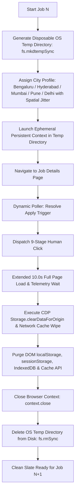

# 🚀 Production Playwright Multi-City Batch Runner (`playwright_applier.js`)

This technical reference documents **`global-applier/playwright_applier.js`**, our production-grade Node.js Playwright automation runner featuring **100% OS-level disposable temporary profiles**, **multi-city domestic geo-rotation with spatial GPS jitter**, **10-second destination page load timers**, and **batch navigation**.

---

## 🏛️ Architecture: 100% Zero-Trace Disposable Profiles

To ensure **0 bytes of cookies, cache, localStorage, or tracking tokens persist** between applications, every job executes in a temporary, OS-isolated sandbox:



---

## 🏙️ Multi-City Domestic Geolocation Database

Each job automatically rotates across major tech hubs with **$\pm 500\text{m}$ spatial Gaussian GPS jitter** so no two applications share the exact same coordinates:

### 🇮🇳 India (`--location IN`):
| City | Base Latitude | Base Longitude | Timezone | Locale |
| :--- | :--- | :--- | :--- | :--- |
| **Bengaluru** | `12.9716` | `77.5946` | `Asia/Kolkata` | `en-IN` |
| **Hyderabad** | `17.3850` | `78.4867` | `Asia/Kolkata` | `en-IN` |
| **Mumbai** | `19.0760` | `72.8777` | `Asia/Kolkata` | `en-IN` |
| **Pune** | `18.5204` | `73.8567` | `Asia/Kolkata` | `en-IN` |
| **Chennai** | `13.0827` | `80.2707` | `Asia/Kolkata` | `en-IN` |
| **Delhi NCR** | `28.6139` | `77.2090` | `Asia/Kolkata` | `en-IN` |
| **Kolkata** | `22.5726` | `88.3639` | `Asia/Kolkata` | `en-IN` |
| **Ahmedabad** | `23.0225` | `72.5714` | `Asia/Kolkata` | `en-IN` |

### 🇺🇸 United States (`--location US`):
* **New York** (`40.7128, -74.0060`, `America/New_York`)
* **San Francisco** (`37.7749, -122.4194`, `America/Los_Angeles`)
* **Austin** (`30.2672, -97.7431`, `America/Chicago`)
* **Seattle** (`47.6062, -122.3321`, `America/Los_Angeles`)
* **Chicago** (`41.8781, -87.6298`, `America/Chicago`)

---

## 🎯 Batch Navigation & Execution Commands

### 1. Run Batch 1 (Jobs 1 to 50)
```powershell
node playwright_applier.js --location IN --batch 50 --batch-num 1 --headed
```

### 2. Run Batch 2 (Jobs 51 to 100)
```powershell
node playwright_applier.js --location IN --batch 50 --batch-num 2 --headed
```

### 3. Run Batch 3 (Jobs 101 to 150)
```powershell
node playwright_applier.js --location IN --batch 50 --batch-num 3 --headed
```

### 4. Run All Batches Automatically (With 30s Cooldown Between Batches)
```powershell
node playwright_applier.js --location IN --batch 50 --auto-next --headed
```

### 5. Resume from Exact Stopped Position
If you ever press `Ctrl+C`, simply run `--resume` to continue immediately:
```powershell
node playwright_applier.js --resume --headed
```

---

## ⚙️ CLI Parameter Reference

| Parameter | Type | Default | Description |
| :--- | :--- | :--- | :--- |
| `--location` | `string` | `IN` | Regional profile (`IN`, `US`, `UK`, `CA`, `DE`, or `ROTATE`). |
| `--batch` | `number` | `50` | Number of applications per batch (`50` or `100`). |
| `--batch-num` | `number` | `1` | Specific batch number to run (`1` = 1-50, `2` = 51-100, `3` = 101-150). |
| `--auto-next` | `flag` | `false` | Automatically proceeds to the next batch after a 30s rest. |
| `--close-wait` | `number` | `10000` | Milliseconds to hold the destination page open (min 10s). |
| `--resume` | `flag` | `false` | Resumes from exact index stored in `progress_state.json`. |
| `--headed` | `flag` | `false` | Launches a visible Chromium window. |
